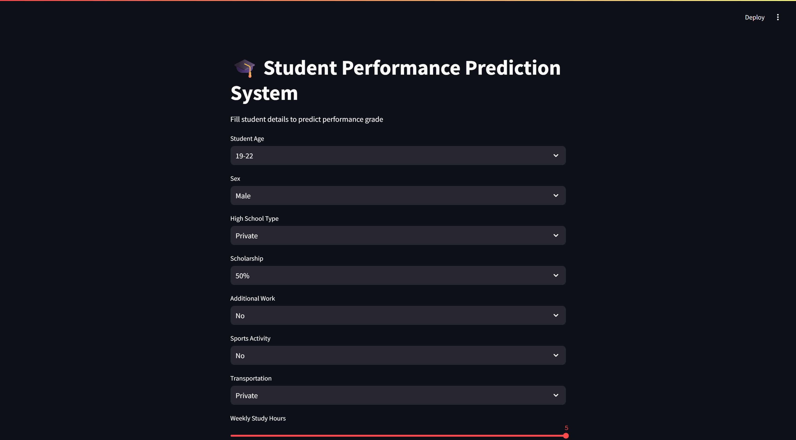
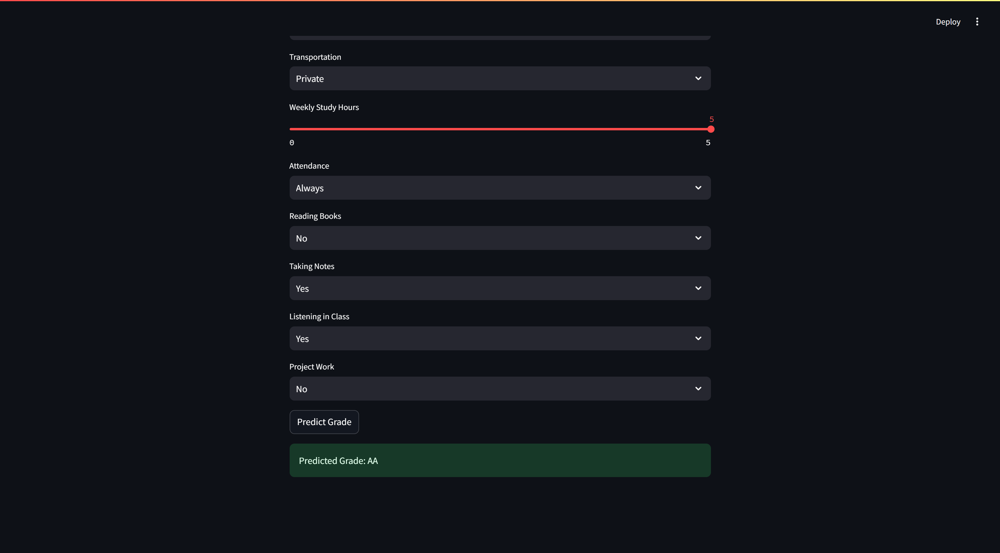

# 🎓 Student Performance Prediction System

## 📌 Project Overview

The **Student Performance Prediction System** is a Machine Learning web application that predicts a student's academic grade based on factors such as study habits, attendance, scholarship status, sports activities, and classroom behavior.

This project was built using **Python, Machine Learning, and Streamlit** to create an interactive and user-friendly prediction system.

🔗 GitHub Repository:
<PRIVATE_URL>

---

## 🚀 Features

* Predicts student grades using Machine Learning
* Interactive web application using Streamlit
* User-friendly input forms
* Real-time prediction results
* Data preprocessing and visualization
* Confusion matrix visualization for model evaluation

---

## 🛠️ Technologies Used

* Python
* Pandas
* NumPy
* Scikit-learn
* Matplotlib
* Seaborn
* Streamlit
* Pickle

---

## 📂 Project Structure

```bash id="7w6lm4"
Student-Performance-Prediction/
│
├── app.py
├── model.pkl
├── Students Performance.csv
├── Student_Performance.ipynb
├── requirements.txt
└── README.md
```

---

## 📊 Machine Learning Workflow

1. Data Collection and Preprocessing
2. Data Cleaning
3. Label Encoding
4. Train-Test Split
5. Model Training using Random Forest Classifier
6. Accuracy Evaluation
7. Model Saving using Pickle
8. Deployment with Streamlit

---

## ▶️ How to Run the Project

### 1. Clone Repository

```bash id="j9gg6u"
git clone https://github.com/manish0505/Student-Performance-Prediction.git
```

### 2. Install Required Libraries

```bash id="ifdy9j"
pip install -r requirements.txt
```

### 3. Run Streamlit App

```bash id="w0e4hj"
streamlit run app.py
```

---

## 📸 Application Screenshots

### Home Interface

```md id="mk5lgh"

```

### Prediction Interface

```md id="7r0vhz"

```

---

## 📈 Model Performance

* Algorithm Used: Random Forest Classifier
* Accuracy Achieved: 24%
* Model Type: Classification Model

---

## 💡 Future Improvements

* Improve prediction accuracy using advanced ML models
* Add data analytics dashboard
* Deploy application online
* Improve UI/UX design
* Add graphical insights and reports

---

## 👨‍💻 Author

**Manish R**

